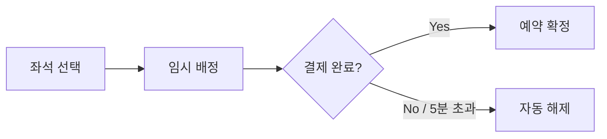

# 과제 상황

공연 좌석 예약 시스템의 핵심 기능을 구현합니다.

백엔드 엔지니어로서 프론트엔드 엔지니어에게 사용 보자가 원하는 공연의 좌석을 선택하고 예약할 수 있는 API를 작성하여 전달해야 합니다.

# **기능 요구사항**

## 초기 데이터

### 공연장 좌석 배치

초기 데이터로 사용할 공연장 좌석 배치는 다음과 같습니다.

**규모:** 20행 × 20열 = 총 400석

**좌석 배치도:**

```
[ 무 대 ]

          일반석 (1~18열)                   커플석
                                          (19~20열)
     +---------------------------------+-----------+
     | V  V  V  V  ...  V  V  V  V  V  |  C     C  |
     | V  V  V  V  ...  V  V  V  V  V  |  C     C  |  VIP (1~3행)
     | V  V  V  V  ...  V  V  V  V  V  |  C     C  |
     +---------------------------------+-----------+
     | R  R  R  R  ...  R  R  R  R  R  |  C     C  |
     | R  R  R  R  ...  R  R  R  R  R  |  C     C  |
     | R  R  R  R  ...  R  R  R  R  R  |  C     C  |  R석 (4~8행)
     | R  R  R  R  ...  R  R  R  R  R  |  C     C  |
     | R  R  R  R  ...  R  R  R  R  R  |  C     C  |
     +---------------------------------+-----------+
     | S  S  S  S  ...  S  S  S  S  S  |  C     C  |
     | S  S  S  S  ...  S  S  S  S  S  |  C     C  |
     | S  S  S  S  ...  S  S  S  S  S  |  C     C  |  S석 (9~14행)
     | S  S  S  S  ...  S  S  S  S  S  |  C     C  |
     | S  S  S  S  ...  S  S  S  S  S  |  C     C  |
     | S  S  S  S  ...  S  S  S  S  S  |  C     C  |
     +---------------------------------+-----------+
     | A  A  A  A  ...  A  A  A  A  A  |  C     C  |
     | A  A  A  A  ...  A  A  A  A  A  |  C     C  |
     | A  A  A  A  ...  A  A  A  A  A  |  C     C  |  A석 (15~20행)
     | A  A  A  A  ...  A  A  A  A  A  |  C     C  |
     | A  A  A  A  ...  A  A  A  A  A  |  C     C  |
     | A  A  A  A  ...  A  A  A  A  A  |  C     C  |
     +---------------------------------+-----------+

     V = VIP석, R = R석, S = S석, A = A석, C = 커플석
```

**등급별 좌석 수:**

|등급|행 범위|일반석 (1~18열)|커플석 (19~20열)|합계|
|---|---|---|---|---|
|VIP|1 ~ 3행|54석|6석 (3쌍)|60석|
|R|4 ~ 8행|90석|10석 (5쌍)|100석|
|S|9 ~ 14행|108석|12석 (6쌍)|120석|
|A|15 ~ 20행|108석|12석 (6쌍)|120석|
|**합계**||**360석**|**40석 (20쌍)**|**400석**|

### 커플석

각 행의 19~20열은 커플석입니다.

**규칙:**

- 커플석은 반드시 같은 행의 연속된 2석을 함께 임시 배정/예약해야 합니다.
- 1석만 선택할 수 없습니다.
- 커플석의 가격은 해당 등급의 일반석과 동일합니다. (2석 합산 결제)

### 공연 및 회차 정보

**공연 1: 레미제라블**

|등급|가격|
|---|---|
|VIP|150,000원|
|R|120,000원|
|S|90,000원|
|A|60,000원|

|회차|날짜|시간|조조 할인|
|---|---|---|---|
|1|2026-12-25|10:00|O (첫 번째 회차)|
|2|2026-12-25|14:00|X|
|3|2026-12-25|19:00|X|

**공연 2: 오페라의 유령**

|등급|가격|
|---|---|
|VIP|170,000원|
|R|140,000원|
|S|110,000원|
|A|80,000원|

|회차|날짜|시간|조조 할인|
|---|---|---|---|
|1|2026-12-25|11:00|O (첫 번째 회차)|
|2|2026-12-25|17:00|X|

### 데이터 초기화

다음 정보는 애플리케이션이 실행될 때 데이터베이스에 자동으로 생성되어야 합니다.

|데이터|설명|
|---|---|
|공연|레미제라블, 오페라의 유령 (2개)|
|회차|레미제라블 3회차, 오페라의 유령 2회차 (총 5개)|
|좌석|20행 × 20열 (총 400석)|

> 참고: 사용자 데이터는 초기 생성하지 않습니다. 사용자 등록 API를 통해 직접 생성해야 합니다.

## 예약 흐름

실제 예매 시스템과 유사하게, 좌석 예약은 **2단계**로 진행됩니다.



- 사용자가 좌석 선택 후 결제 정보를 입력하는 동안 임시 배정을 통해 해당 좌석을 보호합니다.
- 결제를 완료하지 않고 이탈한 경우 좌석이 자동으로 풀려 다른 사용자가 선택할 수 있습니다.
- 결제 완료 시점에 좌석 충돌이 발생하는 것을 방지합니다.

## 요구사항

### 사용자 등록

사용자는 시스템에 본인 정보를 등록할 수 있습니다.

**기본 규칙:**

- 이름과 생년월일을 입력하여 사용자를 등록합니다.
- 등록된 사용자에게는 고유한 사용자 ID가 부여됩니다.
- 동일한 이름과 생년월일로 중복 등록이 가능합니다. (동명이인 허용)

**입력 검증:**

- 이름은 1자 이상이어야 합니다.
- 생년월일은 유효한 날짜여야 하며, 미래 날짜는 허용되지 않습니다.

### 좌석 조회

사용자는 특정 회차의 좌석 정보를 조회할 수 있습니다.

- 전체 좌석 목록과 각 좌석의 상태를 반환합니다.
- 좌석 상태: 예약 가능 / 임시 배정 / 예약 완료
- 각 좌석의 등급, 유형(일반석/커플석), 가격 정보를 포함합니다.

### 좌석 임시 배정

사용자는 원하는 좌석을 선택하여 임시 배정받을 수 있습니다.

**기본 규칙:**

- 예약 가능 상태인 좌석만 임시 배정할 수 있습니다.
- 임시 배정된 좌석은 **5분간** 해당 사용자에게 귀속됩니다.
- 5분이 지나면 임시 배정이 해제되어 다시 예약 가능 상태가 됩니다.
- 이미 임시 배정된 좌석은 다른 사용자가 선택할 수 없습니다.
- 동일 좌석에 대해 여러 사용자가 동시에 임시 배정을 요청할 경우, **단 한 명만 성공**해야 합니다.
- 한 사용자가 동일 회차에서 임시 배정할 수 있는 좌석은 **최대 5개**입니다.
- 해당 회차에 이미 임시 배정된 좌석이 있는 경우, 기존 임시 배정은 자동으로 해제되고 새로운 요청으로 대체됩니다.
- 사용자는 여러 회차에 동시에 임시 배정을 가질 수 있습니다.
- 좌석을 변경하려면 기존 임시 배정을 취소한 후 다시 요청해야 합니다.

**커플석 규칙:**

- 커플석은 반드시 2석(19열, 20열)을 함께 선택해야 합니다.
- 1석만 선택하면 요청이 거부됩니다.

### 예약 확정

사용자는 임시 배정된 좌석에 대해 예약을 확정합니다.

**기본 규칙:**

- 본인이 임시 배정한 좌석만 예약할 수 있습니다.
- 임시 배정된 모든 좌석을 한 번에 예약해야 합니다. 부분 예약은 불가합니다.
- 임시 배정이 만료된 좌석은 예약할 수 없습니다.
- 예약 시 할인 정책을 적용하여 최종 결제 금액을 계산합니다.
- 요청 시 결제 카드사 정보를 입력받습니다. (카드사 할인 적용을 위해)

**[할인 정책]**

다음 할인 정책이 존재합니다:

|할인 종류|적용 조건|할인율|
|---|---|---|
|조조 할인|해당 일자의 첫 번째 회차|10%|
|청소년 할인|공연일 기준 만 19세 미만|20%|
|카드사 할인|제휴 카드사(SHINHAN, KB, WOORI)로 결제 시|5%|

**할인 적용 규칙:**

- 조조 할인과 청소년 할인은 **중복 적용됩니다.**
- 카드사 할인은 **최종 금액에서** 적용됩니다.

**할인 계산 공식:**

```sql
1단계: 조조/청소년 할인 적용 (원가 기준 각각 계산 후 합산 차감)
       중간금액 = 원가 - 조조할인액 - 청소년할인액
       
2단계: 카드사 할인 적용 (중간금액 기준)
       최종금액 = 중간금액 - 카드할인액
```

### 예약 조회 및 취소

- 사용자는 자신의 예약 목록을 조회할 수 있습니다.
- 사용자는 예약을 취소할 수 있습니다.
- 예약 취소는 공연 시작 전까지만 가능합니다.
- 취소된 좌석은 다시 예약 가능 상태가 됩니다.
- 커플석 예약 취소 시 2석 모두 취소됩니다.

### 기타

- 실제 결제 연동은 필요 없습니다. 결제 완료 처리는 Mock으로 구현합니다.
- 인증/인가는 구현 범위에서 제외합니다.

## API 명세

아래는 필수 구현 API입니다. 요청/응답 형식은 자유롭게 설계하되, 일관성을 유지해 주세요.

|기능|Method|Endpoint (예시)|
|---|---|---|
|사용자 등록|POST|`/api/users`|
|좌석 조회|GET|`/api/shows/{showId}/seats`|
|좌석 임시 배정|POST|`/api/shows/{showId}/seats/hold`|
|예약 확정|POST|`/api/reservations`|
|내 예약 조회|GET|`/api/users/{userId}/reservations`|
|예약 취소|DELETE|`/api/reservations/{reservationId}`|

# **기술 요구사항**
- 가독성 있고 유지보수가 용이한 코드를 작성합니다.
- 문서화 기능을 제공해야 합니다.
    - 프론트엔드와 소통할 수 있는 API 명세를 제공
- 명시된 기능 요구사항에 대한 테스트 코드가 작성되어야 합니다.

# 산출물

- git 이력이 포함된 프로젝트를 tar.gz로 압축하여 제출해주세요.
    - 메시지 하단 링크를 통해 제출
- 서버 애플리케이션은 Docker 기반으로 실행 가능한 형태로 만들어주세요.
    - README.md에 다음의 내용을 작성
        - 애플리케이션 설계 구조 설명
            - 가독성 있고 유지보수가 용이한 코드를 작성하기 위해 어떤 설계(개발 방법론, 디자인 패턴 등)를 했는지 설명
        - 테스트 코드 실행 방법
        - 테스트 커버리지 확인 방법
            - Spring은 jacoco
        - 서버 애플리케이션 실행 방법
