# 도메인 모델 다이어그램

> 작성일: 2026-01-10
> 프로젝트: 공연 좌석 예약 시스템

## 목차
1. [전체 도메인 모델 개요](#전체-도메인-모델-개요)
2. [Context별 상세 모델](#context별-상세-모델)
3. [Aggregate 관계도](#aggregate-관계도)
4. [도메인 이벤트 흐름](#도메인-이벤트-흐름)

---

## 전체 도메인 모델 개요

### 4개 Bounded Context와 핵심 Aggregate

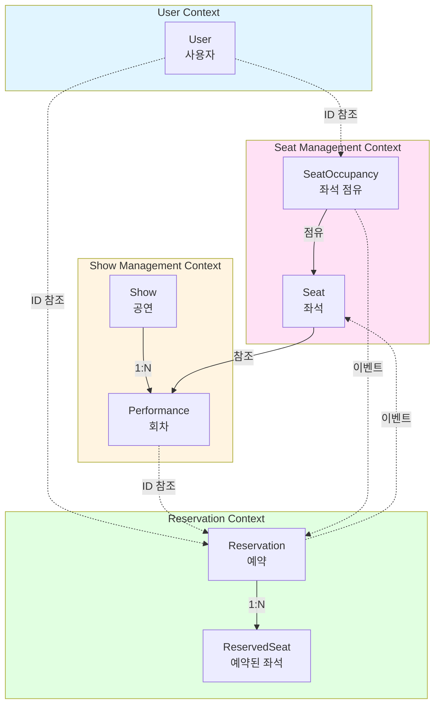
```mermaid
graph TB
    subgraph UC[User Context]
        User[User<br/>사용자]
    end
    
    subgraph SMC[Show Management Context]
        Show[Show<br/>공연]
        Performance[Performance<br/>회차]
        Show -->|1:N| Performance
    end
    
    subgraph SEMC[Seat Management Context]
        Seat[Seat<br/>좌석]
        SeatOccupancy[SeatOccupancy<br/>좌석 점유]
        Seat -->|참조| Performance
        SeatOccupancy -->|점유| Seat
    end
    
    subgraph RC[Reservation Context]
        Reservation[Reservation<br/>예약]
        ReservedSeat[ReservedSeat<br/>예약된 좌석]
        Reservation -->|1:N| ReservedSeat
    end
    
    User -.->|ID 참조| SeatOccupancy
    User -.->|ID 참조| Reservation
    Performance -.->|ID 참조| Reservation
    
    SeatOccupancy -.->|이벤트| Reservation
    Reservation -.->|이벤트| Seat
    
    style UC fill:#e1f5ff
    style SMC fill:#fff4e1
    style SEMC fill:#ffe1f5
    style RC fill:#e1ffe1
```

---

## Context별 상세 모델

### 1. User Context - 사용자 관리

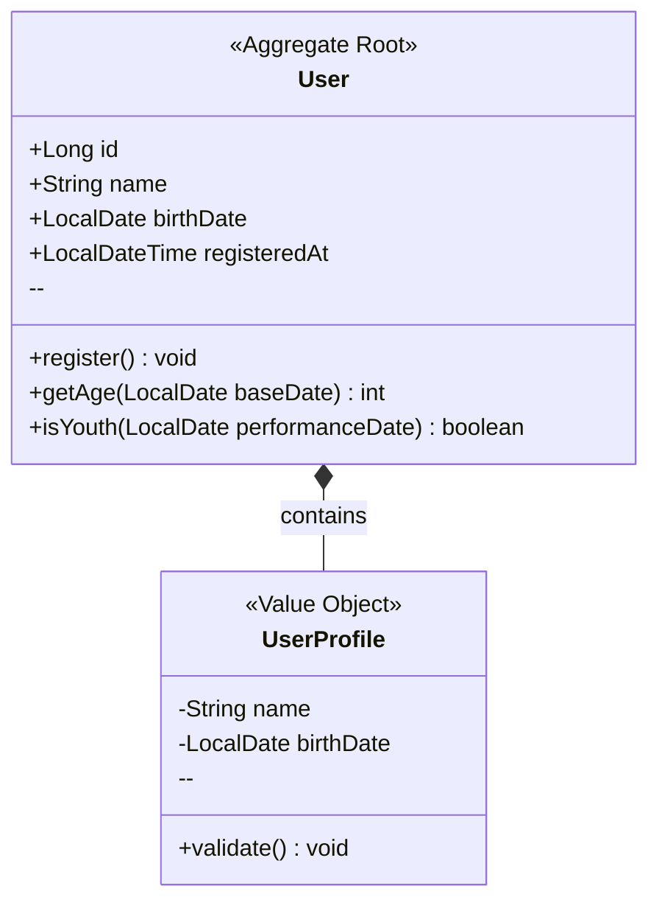
```mermaid
classDiagram
    class User {
        <<Aggregate Root>>
        +Long id
        +String name
        +LocalDate birthDate
        +LocalDateTime registeredAt
        --
        +register() void
        +getAge(LocalDate baseDate) int
        +isYouth(LocalDate performanceDate) boolean
    }
    
    class UserProfile {
        <<Value Object>>
        -String name
        -LocalDate birthDate
        --
        +validate() void
    }
    
    User *-- UserProfile : contains
```

**핵심 개념:**
- 사용자는 이름과 생년월일로 등록
- 동명이인 허용 (중복 등록 가능)
- 청소년 여부는 공연일 기준 만 19세 미만

---

### 2. Show Management Context - 공연/회차 관리

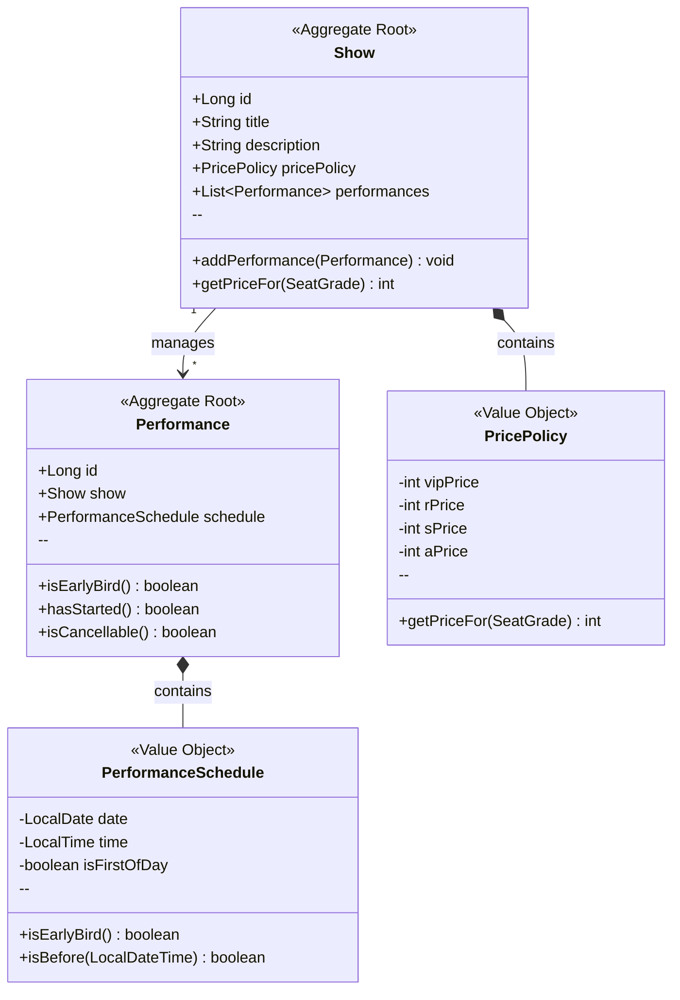
```mermaid
classDiagram
    class Show {
        <<Aggregate Root>>
        +Long id
        +String title
        +String description
        +PricePolicy pricePolicy
        +List~Performance~ performances
        --
        +addPerformance(Performance) void
        +getPriceFor(SeatGrade) int
    }
    
    class Performance {
        <<Aggregate Root>>
        +Long id
        +Show show
        +PerformanceSchedule schedule
        --
        +isEarlyBird() boolean
        +hasStarted() boolean
        +isCancellable() boolean
    }
    
    class PricePolicy {
        <<Value Object>>
        -int vipPrice
        -int rPrice
        -int sPrice
        -int aPrice
        --
        +getPriceFor(SeatGrade) int
    }
    
    class PerformanceSchedule {
        <<Value Object>>
        -LocalDate date
        -LocalTime time
        -boolean isFirstOfDay
        --
        +isEarlyBird() boolean
        +isBefore(LocalDateTime) boolean
    }
    
    Show "1" --> "*" Performance : manages
    Show *-- PricePolicy : contains
    Performance *-- PerformanceSchedule : contains
```

**핵심 개념:**
- Show: 작품 전체 (예: 레미제라블)
- Performance: 특정 일시의 회차
- 조조 회차: 해당 일자의 첫 번째 회차

---

### 3. Seat Management Context - 좌석 관리

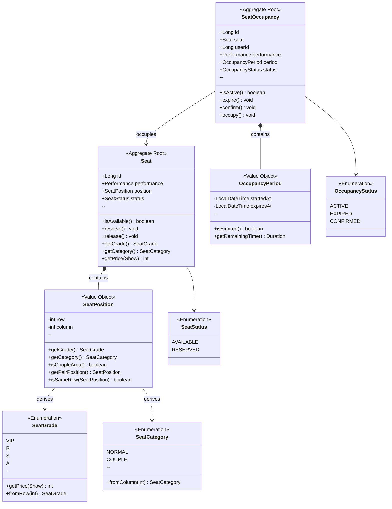
```mermaid
classDiagram
    class Seat {
        <<Aggregate Root>>
        +Long id
        +Performance performance
        +SeatPosition position
        +SeatStatus status
        --
        +isAvailable() boolean
        +reserve() void
        +release() void
        +getGrade() SeatGrade
        +getCategory() SeatCategory
        +getPrice(Show) int
    }
    
    class SeatOccupancy {
        <<Aggregate Root>>
        +Long id
        +Seat seat
        +Long userId
        +Performance performance
        +OccupancyPeriod period
        +OccupancyStatus status
        --
        +isActive() boolean
        +expire() void
        +confirm() void
        +occupy() void
    }
    
    class SeatPosition {
        <<Value Object>>
        -int row
        -int column
        --
        +getGrade() SeatGrade
        +getCategory() SeatCategory
        +isCoupleArea() boolean
        +getPairPosition() SeatPosition
        +isSameRow(SeatPosition) boolean
    }
    
    class OccupancyPeriod {
        <<Value Object>>
        -LocalDateTime startedAt
        -LocalDateTime expiresAt
        --
        +isExpired() boolean
        +getRemainingTime() Duration
    }
    
    class SeatStatus {
        <<Enumeration>>
        AVAILABLE
        RESERVED
    }
    
    class OccupancyStatus {
        <<Enumeration>>
        ACTIVE
        EXPIRED
        CONFIRMED
    }
    
    class SeatGrade {
        <<Enumeration>>
        VIP
        R
        S
        A
        --
        +getPrice(Show) int
        +fromRow(int) SeatGrade
    }
    
    class SeatCategory {
        <<Enumeration>>
        NORMAL
        COUPLE
        --
        +fromColumn(int) SeatCategory
    }
    
    Seat *-- SeatPosition : contains
    Seat --> SeatStatus
    SeatOccupancy --> Seat : occupies
    SeatOccupancy *-- OccupancyPeriod : contains
    SeatOccupancy --> OccupancyStatus
    SeatPosition ..> SeatGrade : derives
    SeatPosition ..> SeatCategory : derives
```

**핵심 개념:**
- Seat: 좌석의 물리적 정보 (위치, 상태)
- SeatOccupancy: 5분간 임시 점유 프로세스
- SeatPosition: 행/열 위치 (불변)
- 좌석 등급과 카테고리는 위치에서 자동 계산

**좌석 배치 규칙:**
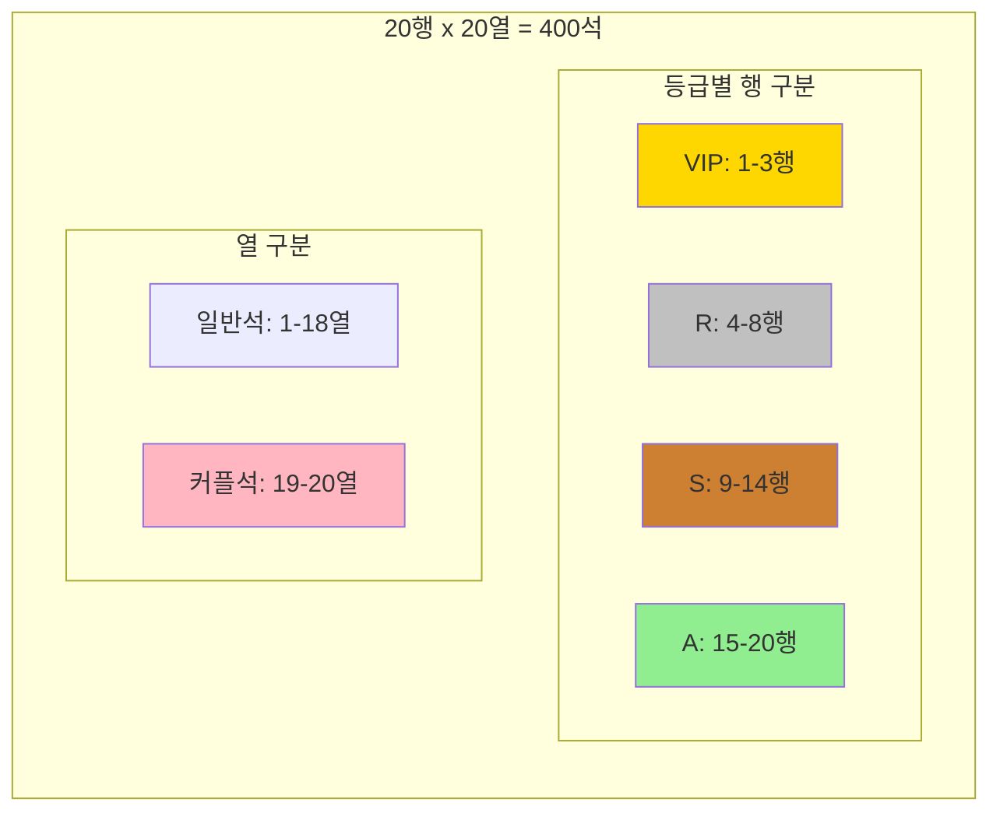
```mermaid
graph LR
    subgraph "20행 x 20열 = 400석"
        subgraph "등급별 행 구분"
            VIP[VIP: 1-3행]
            R[R: 4-8행]
            S[S: 9-14행]
            A[A: 15-20행]
        end
        
        subgraph "열 구분"
            Normal[일반석: 1-18열]
            Couple[커플석: 19-20열]
        end
    end
    
    style VIP fill:#ffd700
    style R fill:#c0c0c0
    style S fill:#cd7f32
    style A fill:#90ee90
    style Couple fill:#ffb6c1
```

---

### 4. Reservation Context - 예약/결제 관리

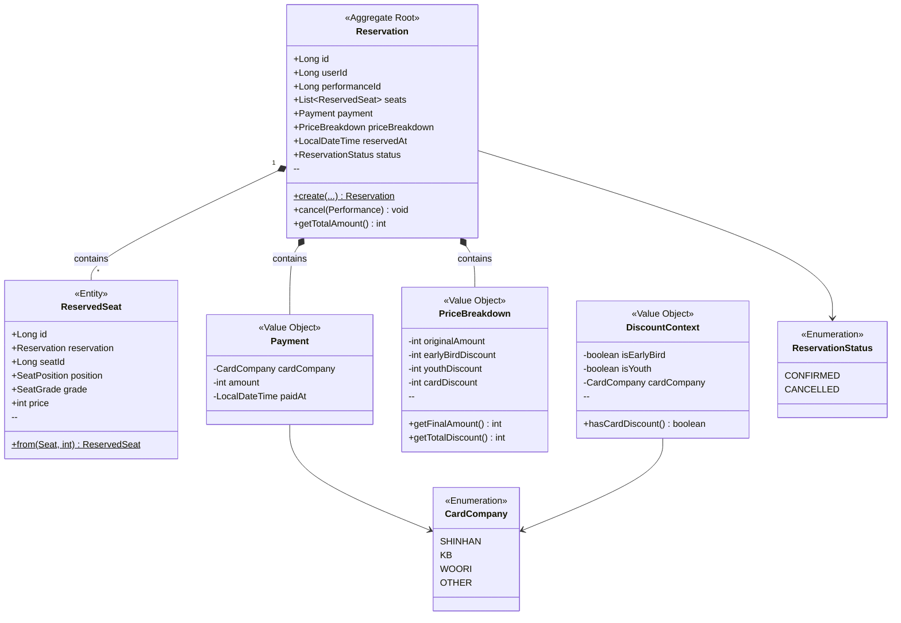
```mermaid
classDiagram
    class Reservation {
        <<Aggregate Root>>
        +Long id
        +Long userId
        +Long performanceId
        +List~ReservedSeat~ seats
        +Payment payment
        +PriceBreakdown priceBreakdown
        +LocalDateTime reservedAt
        +ReservationStatus status
        --
        +create(...) Reservation$
        +cancel(Performance) void
        +getTotalAmount() int
    }
    
    class ReservedSeat {
        <<Entity>>
        +Long id
        +Reservation reservation
        +Long seatId
        +SeatPosition position
        +SeatGrade grade
        +int price
        --
        +from(Seat, int) ReservedSeat$
    }
    
    class Payment {
        <<Value Object>>
        -CardCompany cardCompany
        -int amount
        -LocalDateTime paidAt
    }
    
    class PriceBreakdown {
        <<Value Object>>
        -int originalAmount
        -int earlyBirdDiscount
        -int youthDiscount
        -int cardDiscount
        --
        +getFinalAmount() int
        +getTotalDiscount() int
    }
    
    class DiscountContext {
        <<Value Object>>
        -boolean isEarlyBird
        -boolean isYouth
        -CardCompany cardCompany
        --
        +hasCardDiscount() boolean
    }
    
    class ReservationStatus {
        <<Enumeration>>
        CONFIRMED
        CANCELLED
    }
    
    class CardCompany {
        <<Enumeration>>
        SHINHAN
        KB
        WOORI
        OTHER
    }
    
    Reservation "1" *-- "*" ReservedSeat : contains
    Reservation *-- Payment : contains
    Reservation *-- PriceBreakdown : contains
    Reservation --> ReservationStatus
    Payment --> CardCompany
    DiscountContext --> CardCompany
```

**핵심 개념:**
- Reservation: 결제 완료된 확정 예약
- ReservedSeat: 예약 시점의 좌석 정보 스냅샷 (불변)
- PriceBreakdown: 할인 내역 상세

---

## Aggregate 관계도

### 전체 Aggregate와 연관 관계

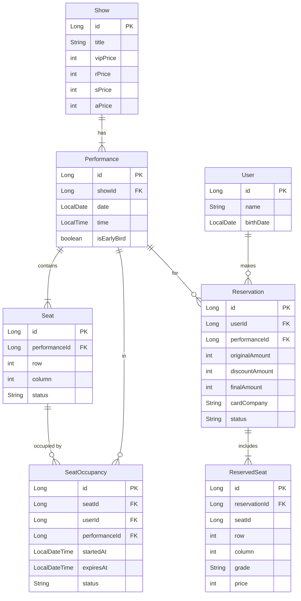
```mermaid
erDiagram
    User ||--o{ Reservation : "makes"
    Show ||--|{ Performance : "has"
    Performance ||--|{ Seat : "contains"
    Performance ||--o{ SeatOccupancy : "in"
    Performance ||--o{ Reservation : "for"
    
    Seat ||--o{ SeatOccupancy : "occupied by"
    
    Reservation ||--|{ ReservedSeat : "includes"
    
    User {
        Long id PK
        String name
        LocalDate birthDate
    }
    
    Show {
        Long id PK
        String title
        int vipPrice
        int rPrice
        int sPrice
        int aPrice
    }
    
    Performance {
        Long id PK
        Long showId FK
        LocalDate date
        LocalTime time
        boolean isEarlyBird
    }
    
    Seat {
        Long id PK
        Long performanceId FK
        int row
        int column
        String status
    }
    
    SeatOccupancy {
        Long id PK
        Long seatId FK
        Long userId FK
        Long performanceId FK
        LocalDateTime startedAt
        LocalDateTime expiresAt
        String status
    }
    
    Reservation {
        Long id PK
        Long userId FK
        Long performanceId FK
        int originalAmount
        int discountAmount
        int finalAmount
        String cardCompany
        String status
    }
    
    ReservedSeat {
        Long id PK
        Long reservationId FK
        Long seatId
        int row
        int column
        String grade
        int price
    }
```

---

## 도메인 이벤트 흐름

### 예약 프로세스 이벤트 시퀀스

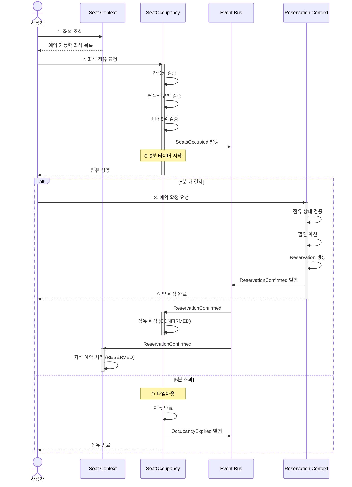
```mermaid
sequenceDiagram
    actor User as 사용자
    participant Seat as Seat Context
    participant Occupancy as SeatOccupancy
    participant Events as Event Bus
    participant Reservation as Reservation Context
    
    User->>Seat: 1. 좌석 조회
    Seat-->>User: 예약 가능한 좌석 목록
    
    User->>Occupancy: 2. 좌석 점유 요청
    activate Occupancy
    Occupancy->>Occupancy: 가용성 검증
    Occupancy->>Occupancy: 커플석 규칙 검증
    Occupancy->>Occupancy: 최대 5석 검증
    Occupancy->>Events: SeatsOccupied 발행
    Note over Occupancy: ⏰ 5분 타이머 시작
    Occupancy-->>User: 점유 성공
    deactivate Occupancy
    
    alt 5분 내 결제
        User->>Reservation: 3. 예약 확정 요청
        activate Reservation
        Reservation->>Reservation: 점유 상태 검증
        Reservation->>Reservation: 할인 계산
        Reservation->>Reservation: Reservation 생성
        Reservation->>Events: ReservationConfirmed 발행
        Reservation-->>User: 예약 확정 완료
        deactivate Reservation
        
        Events->>Occupancy: ReservationConfirmed
        activate Occupancy
        Occupancy->>Occupancy: 점유 확정 (CONFIRMED)
        deactivate Occupancy
        
        Events->>Seat: ReservationConfirmed
        activate Seat
        Seat->>Seat: 좌석 예약 처리 (RESERVED)
        deactivate Seat
        
    else 5분 초과
        Note over Occupancy: ⏰ 타임아웃
        Occupancy->>Occupancy: 자동 만료
        Occupancy->>Events: OccupancyExpired 발행
        Occupancy-->>User: 점유 만료
    end
```

### 예약 취소 프로세스

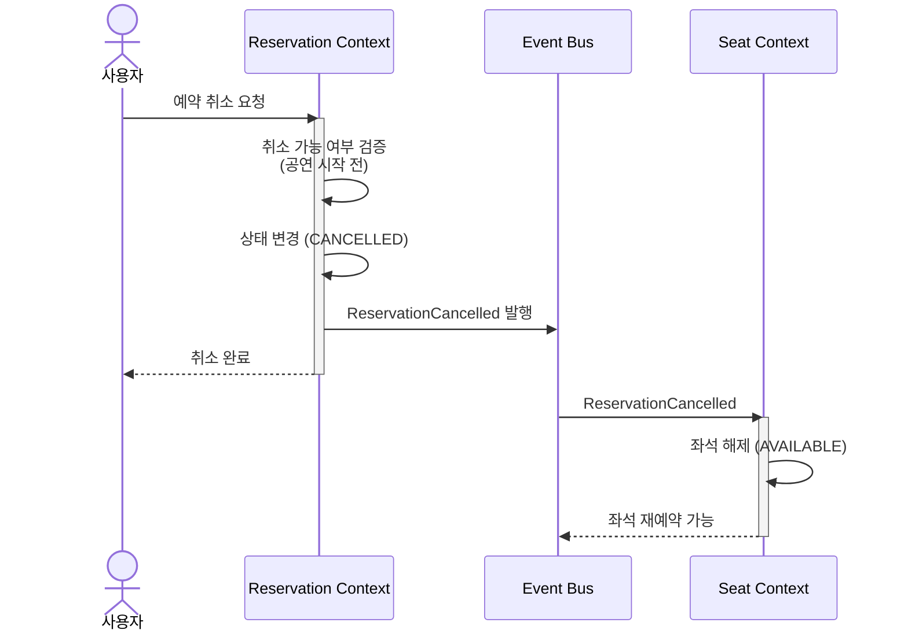
```mermaid
sequenceDiagram
    actor User as 사용자
    participant Reservation as Reservation Context
    participant Events as Event Bus
    participant Seat as Seat Context
    
    User->>Reservation: 예약 취소 요청
    activate Reservation
    Reservation->>Reservation: 취소 가능 여부 검증<br/>(공연 시작 전)
    Reservation->>Reservation: 상태 변경 (CANCELLED)
    Reservation->>Events: ReservationCancelled 발행
    Reservation-->>User: 취소 완료
    deactivate Reservation
    
    Events->>Seat: ReservationCancelled
    activate Seat
    Seat->>Seat: 좌석 해제 (AVAILABLE)
    Seat-->>Events: 좌석 재예약 가능
    deactivate Seat
```

---

## 핵심 비즈니스 규칙 시각화

### 할인 정책 적용 순서

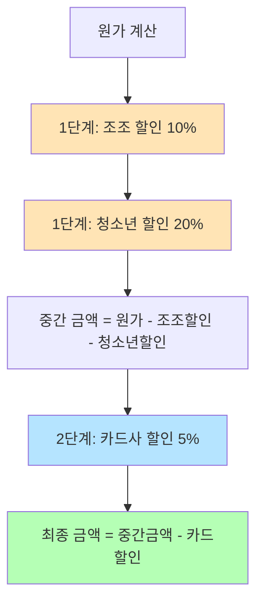
```mermaid
graph TD
    Start[원가 계산] --> A[1단계: 조조 할인 10%]
    A --> B[1단계: 청소년 할인 20%]
    B --> C[중간 금액 = 원가 - 조조할인 - 청소년할인]
    C --> D[2단계: 카드사 할인 5%]
    D --> E[최종 금액 = 중간금액 - 카드할인]
    
    style A fill:#ffe4b5
    style B fill:#ffe4b5
    style D fill:#b5e4ff
    style E fill:#b5ffb5
```

**할인 적용 예시:**
- 원가: 100,000원
- 조조 할인 (10%): -10,000원
- 청소년 할인 (20%): -20,000원
- 중간 금액: 70,000원
- 카드 할인 (5%): -3,500원
- **최종 금액: 66,500원**

### 좌석 점유 생명주기

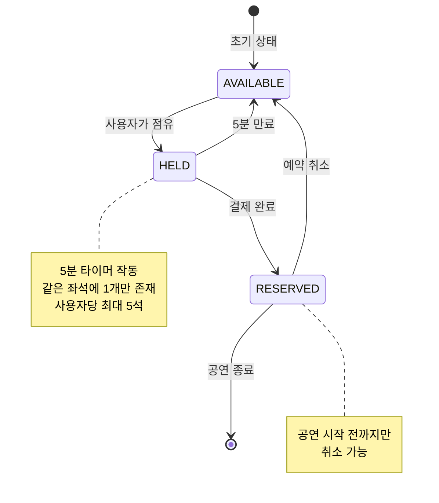
```mermaid
stateDiagram-v2
    [*] --> AVAILABLE : 초기 상태
    
    AVAILABLE --> HELD : 사용자가 점유
    
    HELD --> AVAILABLE : 5분 만료
    HELD --> RESERVED : 결제 완료
    
    RESERVED --> AVAILABLE : 예약 취소
    RESERVED --> [*] : 공연 종료
    
    note right of HELD
        5분 타이머 작동
        같은 좌석에 1개만 존재
        사용자당 최대 5석
    end note
    
    note right of RESERVED
        공연 시작 전까지만
        취소 가능
    end note
```

### SeatOccupancy 상태 전이

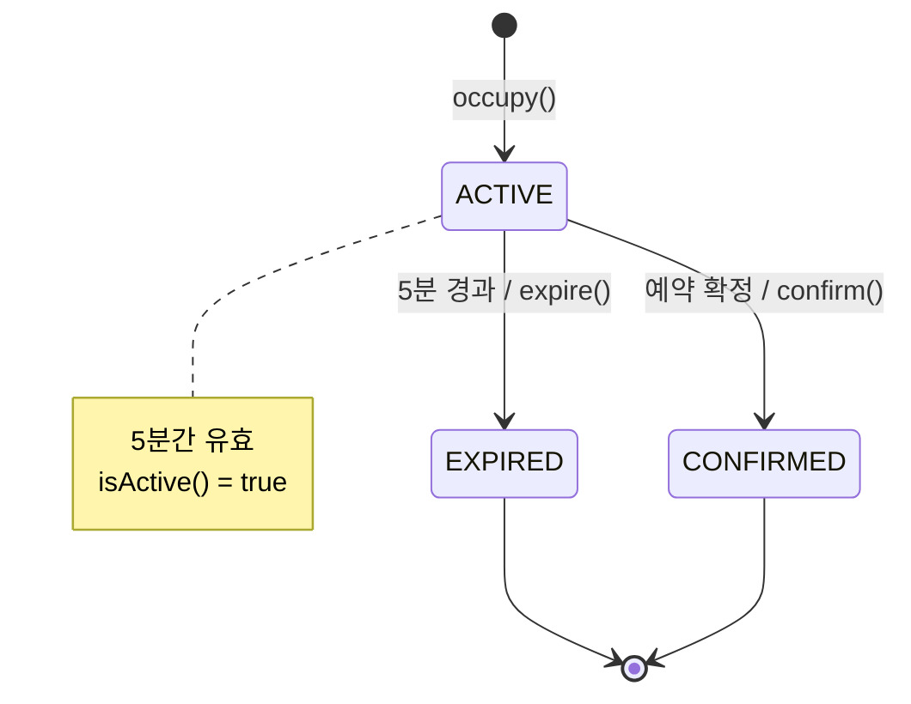
```mermaid
stateDiagram-v2
    [*] --> ACTIVE : occupy()
    
    ACTIVE --> EXPIRED : 5분 경과 / expire()
    ACTIVE --> CONFIRMED : 예약 확정 / confirm()
    
    EXPIRED --> [*]
    CONFIRMED --> [*]
    
    note right of ACTIVE
        5분간 유효
        isActive() = true
    end note
```

---

## 값 객체 구조도

### SeatPosition - 좌석 위치

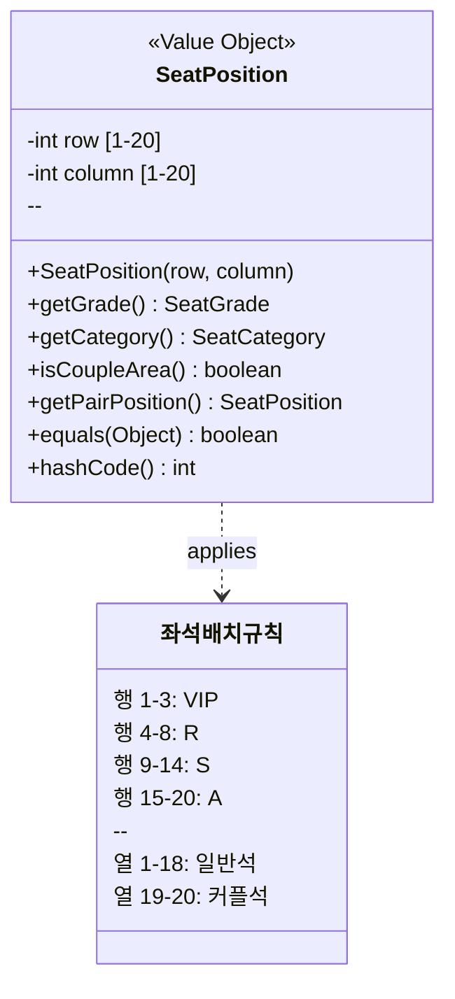
```mermaid
classDiagram
    class SeatPosition {
        <<Value Object>>
        -int row [1-20]
        -int column [1-20]
        --
        +SeatPosition(row, column)
        +getGrade() SeatGrade
        +getCategory() SeatCategory
        +isCoupleArea() boolean
        +getPairPosition() SeatPosition
        +equals(Object) boolean
        +hashCode() int
    }
    
    class 좌석배치규칙 {
        행 1-3: VIP
        행 4-8: R
        행 9-14: S
        행 15-20: A
        --
        열 1-18: 일반석
        열 19-20: 커플석
    }
    
    SeatPosition ..> 좌석배치규칙 : applies
```

### 커플석 검증 로직

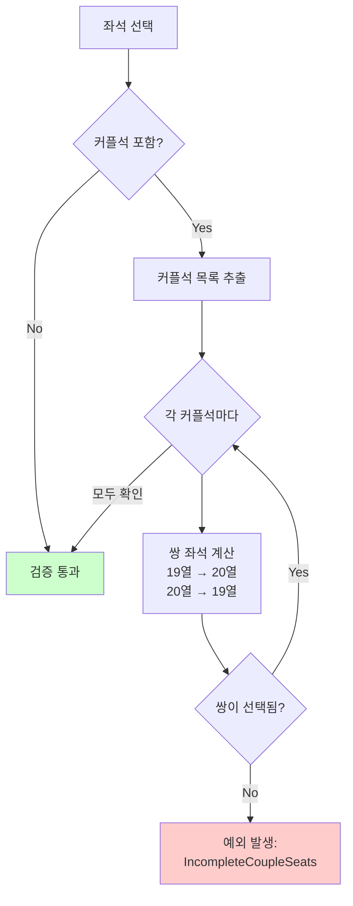
```mermaid
flowchart TD
    Start[좌석 선택] --> A{커플석 포함?}
    A -->|No| End[검증 통과]
    A -->|Yes| B[커플석 목록 추출]
    B --> C{각 커플석마다}
    C --> D[쌍 좌석 계산<br/>19열 → 20열<br/>20열 → 19열]
    D --> E{쌍이 선택됨?}
    E -->|Yes| C
    E -->|No| F[예외 발생:<br/>IncompleteCoupleSeats]
    C -->|모두 확인| End
    
    style F fill:#ffcccc
    style End fill:#ccffcc
```

---

## 도메인 서비스

### CoupleSeatValidator

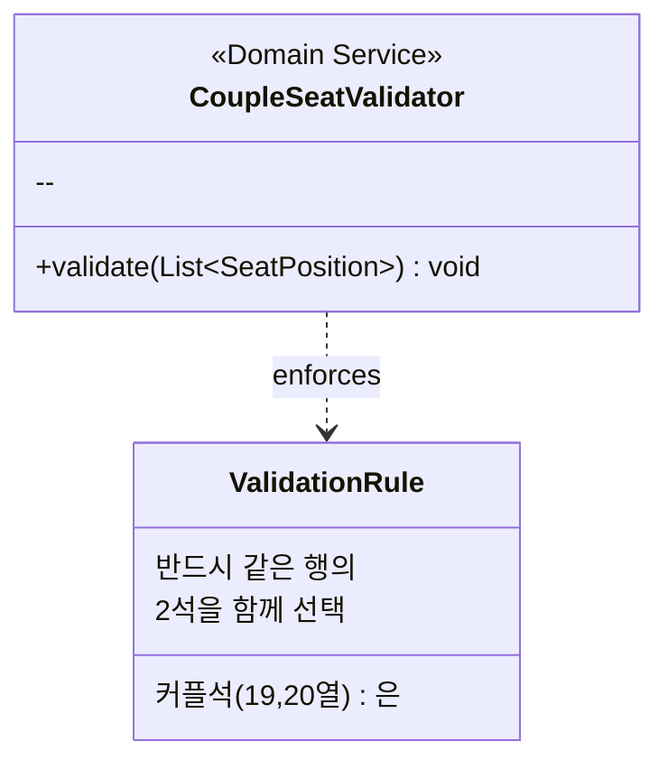
```mermaid
classDiagram
    class CoupleSeatValidator {
        <<Domain Service>>
        --
        +validate(List~SeatPosition~) void
    }
    
    class ValidationRule {
        커플석(19,20열)은
        반드시 같은 행의
        2석을 함께 선택
    }
    
    CoupleSeatValidator ..> ValidationRule : enforces
```

### PriceCalculator

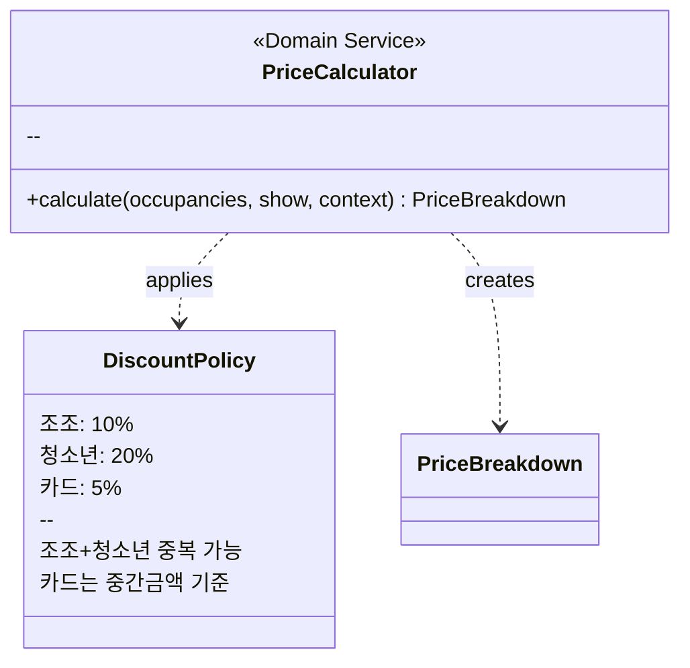
```mermaid
classDiagram
    class PriceCalculator {
        <<Domain Service>>
        --
        +calculate(occupancies, show, context) PriceBreakdown
    }
    
    class DiscountPolicy {
        조조: 10%
        청소년: 20%
        카드: 5%
        --
        조조+청소년 중복 가능
        카드는 중간금액 기준
    }
    
    PriceCalculator ..> DiscountPolicy : applies
    PriceCalculator ..> PriceBreakdown : creates
```

---

## 패키지 구조

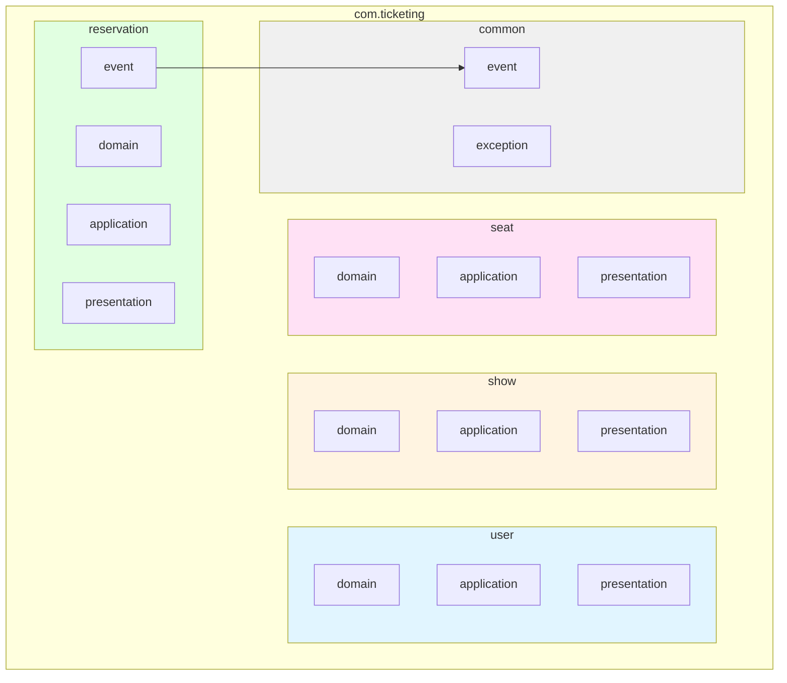
```mermaid
graph TB
    subgraph "com.ticketing"
        subgraph user[user]
            u_domain[domain]
            u_application[application]
            u_presentation[presentation]
        end
        
        subgraph show[show]
            s_domain[domain]
            s_application[application]
            s_presentation[presentation]
        end
        
        subgraph seat[seat]
            se_domain[domain]
            se_application[application]
            se_presentation[presentation]
        end
        
        subgraph reservation[reservation]
            r_domain[domain]
            r_application[application]
            r_presentation[presentation]
            r_event[event]
        end
        
        subgraph common[common]
            c_event[event]
            c_exception[exception]
        end
    end
    
    r_event --> c_event
    
    style user fill:#e1f5ff
    style show fill:#fff4e1
    style seat fill:#ffe1f5
    style reservation fill:#e1ffe1
    style common fill:#f0f0f0
```

---

## 요약

### Aggregate Root (6개)
1. **User** - 사용자
2. **Show** - 공연
3. **Performance** - 회차
4. **Seat** - 좌석
5. **SeatOccupancy** - 좌석 점유
6. **Reservation** - 예약

### 값 객체 (8개)
1. UserProfile
2. PricePolicy
3. PerformanceSchedule
4. SeatPosition ⭐
5. OccupancyPeriod ⭐
6. Payment
7. PriceBreakdown ⭐
8. DiscountContext

### 도메인 이벤트 (4개)
1. SeatsOccupied
2. OccupancyExpired
3. ReservationConfirmed ⭐
4. ReservationCancelled ⭐

### 도메인 서비스 (2개)
1. CoupleSeatValidator
2. PriceCalculator

---

## 참고 문서
- [Event-Storming-Design.md](Event-Storming-Design.md) - 이벤트 스토밍 전체
- [Bounded-Context-Detail.md](Bounded-Context-Detail.md) - Context 상세 설계
