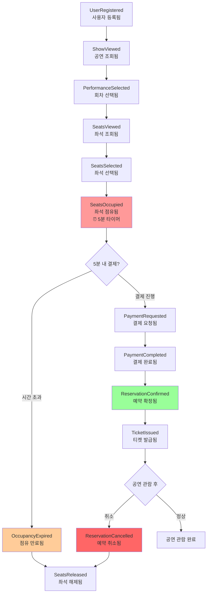
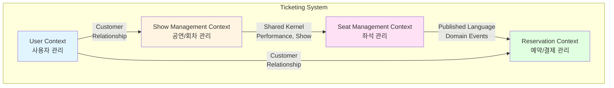
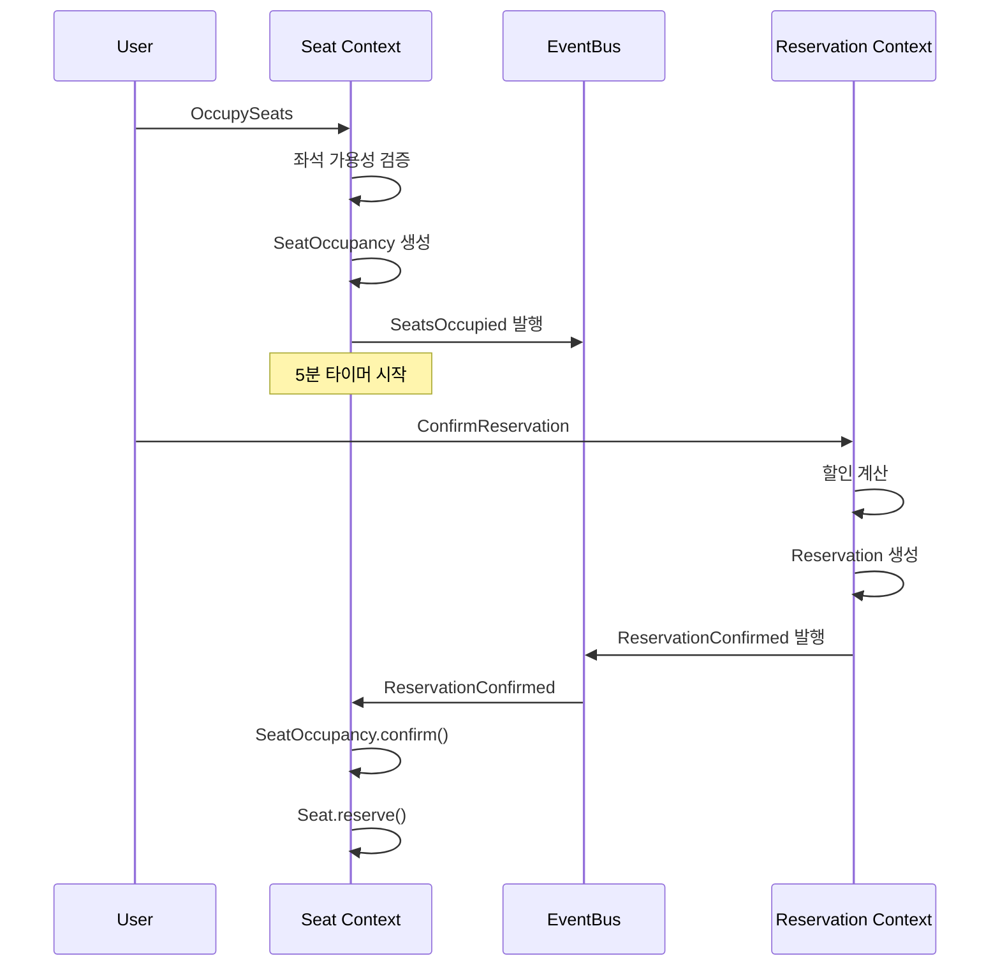

# 공연 좌석 예약 시스템 - Event Storming

> 작성일: 2026-01-10
> 프로젝트: 공연 좌석 예약 시스템 백엔드 API

## 📌 목차
1. [도메인 이벤트 흐름](#도메인-이벤트-흐름)
2. [Bounded Context 정의](#bounded-context-정의)
3. [Context Map](#context-map)
4. [Aggregate 설계](#aggregate-설계)
5. [도메인 이벤트 상세](#도메인-이벤트-상세)
6. [유비쿼터스 언어](#유비쿼터스-언어)

---

## 도메인 이벤트 흐름

### 사용자 여정에 따른 전체 이벤트 플로우



### 핵심 이벤트 타임라인

| 시간 | 이벤트 | Context | 설명 |
|-----|--------|---------|------|
| T+0 | SeatsOccupied | Seat Management | 좌석 점유 시작, 5분 타이머 작동 |
| T+5m | OccupancyExpired | Seat Management | 결제 미완료 시 자동 만료 |
| T+0~5m | PaymentCompleted | Reservation | 결제 완료 (5분 내) |
| T+0~5m | ReservationConfirmed | Reservation | 예약 확정 → 좌석 상태 변경 |
| ~공연시작 | ReservationCancelled | Reservation | 예약 취소 가능 기간 |

---

## Bounded Context 정의

### 1️⃣ User Context (사용자 관리)

**책임**: 사용자 등록 및 프로필 관리

```
┌─────────────────────────┐
│   User Context          │
├─────────────────────────┤
│ Aggregates:             │
│  • User                 │
│                         │
│ Events:                 │
│  • UserRegistered       │
│                         │
│ Commands:               │
│  • RegisterUser         │
└─────────────────────────┘
```

**핵심 모델**:
- User (Root)
- UserProfile (Value Object)

### 2️⃣ Show Management Context (공연 관리)

**책임**: 공연 정보와 회차 일정 관리

```
┌─────────────────────────────────┐
│   Show Management Context       │
├─────────────────────────────────┤
│ Aggregates:                     │
│  • Show                         │
│  • Performance                  │
│                                 │
│ Value Objects:                  │
│  • PricePolicy                  │
│  • PerformanceSchedule          │
│                                 │
│ Events:                         │
│  • ShowCreated                  │
│  • PerformanceScheduled         │
│                                 │
│ Commands:                       │
│  • CreateShow                   │
│  • SchedulePerformance          │
│  • BrowseShows                  │
│  • SelectPerformance            │
└─────────────────────────────────┘
```

**핵심 모델**:
- Show (Root): 공연 메타데이터
- Performance (Root): 특정 일시의 회차
- PricePolicy (Value Object): 등급별 가격 정책
- PerformanceSchedule (Value Object): 일정 정보

### 3️⃣ Seat Management Context (좌석 관리)

**책임**: 좌석 배치, 가용성 관리, 임시 점유 관리

```
┌─────────────────────────────────┐
│   Seat Management Context       │
├─────────────────────────────────┤
│ Aggregates:                     │
│  • Seat                         │
│  • SeatOccupancy                │
│                                 │
│ Value Objects:                  │
│  • SeatPosition                 │
│  • OccupancyPeriod              │
│                                 │
│ Events:                         │
│  • SeatsOccupied ⭐             │
│  • OccupancyExpired             │
│  • OccupancyConfirmed           │
│  • SeatsReleased                │
│                                 │
│ Commands:                       │
│  • ViewAvailableSeats           │
│  • OccupySeats                  │
│  • ReleaseOccupancy             │
│  • ConfirmOccupancy             │
│                                 │
│ Domain Services:                │
│  • CoupleSeatValidator          │
│  • SeatAvailabilityChecker      │
└─────────────────────────────────┘
```

**핵심 모델**:
- Seat (Root): 좌석 물리적 정보 + 상태
- SeatOccupancy (Root): 임시 점유 프로세스
- SeatPosition (Value Object): 행/열 위치
- OccupancyPeriod (Value Object): 점유 기간 (5분)

### 4️⃣ Reservation Context (예약/결제 관리)

**책임**: 예약 확정, 결제 처리, 할인 계산, 티켓 발급

```
┌─────────────────────────────────┐
│   Reservation Context           │
├─────────────────────────────────┤
│ Aggregates:                     │
│  • Reservation                  │
│                                 │
│ Entities:                       │
│  • ReservedSeat                 │
│                                 │
│ Value Objects:                  │
│  • Payment                      │
│  • PriceBreakdown               │
│  • DiscountContext              │
│                                 │
│ Events:                         │
│  • PaymentRequested             │
│  • PaymentCompleted             │
│  • ReservationConfirmed ⭐      │
│  • TicketIssued                 │
│  • ReservationCancelled ⭐      │
│                                 │
│ Commands:                       │
│  • RequestPayment               │
│  • CompletePayment              │
│  • ConfirmReservation           │
│  • CancelReservation            │
│  • ViewMyReservations           │
│                                 │
│ Domain Services:                │
│  • PriceCalculator              │
│  • DiscountPolicy               │
└─────────────────────────────────┘
```

**핵심 모델**:
- Reservation (Root): 확정된 예약
- ReservedSeat (Entity): 예약된 좌석 스냅샷
- Payment (Value Object): 결제 정보
- PriceBreakdown (Value Object): 가격 구성 상세
- PriceCalculator (Domain Service): 할인 계산 로직

---

## Context Map

### 전체 시스템 Context 관계도



### Context 간 통합 패턴

| From Context | To Context | Integration Pattern | 설명 |
|--------------|------------|---------------------|------|
| User | Show Management | **Customer/Supplier** | User는 공연 정보 소비자 |
| Show Management | Seat Management | **Shared Kernel** | Performance 공유 |
| Seat Management | Reservation | **Published Language** | 도메인 이벤트로 통신 |
| User | Reservation | **Customer/Supplier** | User는 예약 생성자 |

### 핵심 도메인 이벤트 (Context 간 통신)

#### Seat Context → Reservation Context
```java
// 좌석이 점유되었을 때 발행
public class SeatsOccupied implements DomainEvent {
    private final Long occupancyId;
    private final List<Long> seatIds;
    private final Long userId;
    private final Long performanceId;
    private final LocalDateTime occurredAt;
    private final LocalDateTime expiresAt;
}
```

#### Reservation Context → Seat Context
```java
// 예약이 확정되었을 때 발행
public class ReservationConfirmed implements DomainEvent {
    private final Long reservationId;
    private final List<Long> seatIds;
    private final Long userId;
    private final LocalDateTime occurredAt;
}

// 예약이 취소되었을 때 발행
public class ReservationCancelled implements DomainEvent {
    private final Long reservationId;
    private final List<Long> seatIds;
    private final LocalDateTime occurredAt;
}
```

---

## Aggregate 설계

### Aggregate Root 식별 원칙

1. **트랜잭션 일관성 경계**: 하나의 트랜잭션으로 변경되어야 하는 단위
2. **불변식(Invariant) 보호**: 비즈니스 규칙을 강제하는 경계
3. **식별자 기준**: 독립적인 생명주기를 가지는 엔티티

### 1. User Aggregate

```
┌─────────────────────┐
│  User (Root)        │
├─────────────────────┤
│ + id                │
│ + name              │
│ + birthDate         │
│ - profile           │ ← Value Object
├─────────────────────┤
│ + register()        │
│ + getAge()          │
│ + isYouth()         │
└─────────────────────┘
```

**불변식**:
- 이름은 1자 이상
- 생년월일은 미래 날짜 불가

### 2. Show Aggregate

```
┌─────────────────────────┐
│  Show (Root)            │
├─────────────────────────┤
│ + id                    │
│ + title                 │
│ + description           │
│ - pricePolicy           │ ← Value Object
│ - performances          │ ← List<Performance>
├─────────────────────────┤
│ + addPerformance()      │
│ + getPriceFor(grade)    │
└─────────────────────────┘
```

**불변식**:
- 공연은 최소 1개 이상의 회차를 가져야 함
- 가격은 양수여야 함

### 3. Performance Aggregate

```
┌─────────────────────────┐
│  Performance (Root)     │
├─────────────────────────┤
│ + id                    │
│ - show                  │ ← Show 참조
│ - schedule              │ ← Value Object
├─────────────────────────┤
│ + isEarlyBird()         │
│ + hasStarted()          │
│ + isCancellable()       │
└─────────────────────────┘
```

**불변식**:
- 공연 시작 시간은 현재보다 미래여야 함
- 같은 공연장에서 시간 중복 불가

### 4. Seat Aggregate

```
┌─────────────────────────┐
│  Seat (Root)            │
├─────────────────────────┤
│ + id                    │
│ - performance           │ ← Performance 참조
│ - position              │ ← Value Object (row, col)
│ + status                │ ← AVAILABLE, RESERVED
├─────────────────────────┤
│ + isAvailable()         │
│ + reserve()             │
│ + release()             │
│ + getGrade()            │
│ + getCategory()         │
└─────────────────────────┘
```

**불변식**:
- 예약 가능 상태에서만 점유 가능
- 이미 예약된 좌석은 변경 불가

### 5. SeatOccupancy Aggregate

```
┌─────────────────────────┐
│  SeatOccupancy (Root)   │
├─────────────────────────┤
│ + id                    │
│ - seat                  │ ← Seat 참조
│ + userId                │
│ - period                │ ← Value Object (5분)
│ + status                │ ← ACTIVE, EXPIRED, CONFIRMED
├─────────────────────────┤
│ + isActive()            │
│ + expire()              │
│ + confirm()             │
│ + occupy()              │ ← 도메인 이벤트 발행
└─────────────────────────┘
```

**불변식**:
- 점유는 5분 제한
- 같은 좌석에 활성 점유는 1개만 존재
- 사용자당 회차별 최대 5석까지만 점유 가능
- 커플석은 반드시 2석 동시 점유

### 6. Reservation Aggregate

```
┌─────────────────────────────┐
│  Reservation (Root)         │
├─────────────────────────────┤
│ + id                        │
│ + userId                    │
│ + performanceId             │
│ - seats                     │ ← List<ReservedSeat>
│ - payment                   │ ← Value Object
│ - priceBreakdown            │ ← Value Object
│ + status                    │ ← CONFIRMED, CANCELLED
├─────────────────────────────┤
│ + create(...)               │ ← Factory Method
│ + cancel()                  │
│ + getTotalAmount()          │
└─────────────────────────────┘
       │
       │ contains
       ↓
┌─────────────────────────────┐
│  ReservedSeat (Entity)      │
├─────────────────────────────┤
│ + id                        │
│ + seatId                    │ ← 참조용 ID
│ - position                  │ ← Snapshot
│ + grade                     │ ← Snapshot
│ + price                     │ ← Snapshot
└─────────────────────────────┘
```

**불변식**:
- 예약은 활성 점유에서만 생성 가능
- 모든 점유된 좌석을 한 번에 예약 (부분 예약 불가)
- 공연 시작 전까지만 취소 가능
- 최종 금액은 항상 양수

---

## 도메인 이벤트 상세

### 이벤트 발행 시점 및 처리



### 주요 이벤트 명세

#### SeatsOccupied (좌석 점유됨)
```java
public class SeatsOccupied implements DomainEvent {
    private final Long occupancyId;
    private final List<Long> seatIds;
    private final Long userId;
    private final Long performanceId;
    private final LocalDateTime occurredAt;
    private final LocalDateTime expiresAt;  // 5분 후
}
```

**발행 시점**: SeatOccupancy.occupy() 호출 시
**구독자**: 없음 (현재는 로깅/모니터링 용도)

#### OccupancyExpired (점유 만료됨)
```java
public class OccupancyExpired implements DomainEvent {
    private final Long occupancyId;
    private final List<Long> seatIds;
    private final Long userId;
    private final LocalDateTime occurredAt;
}
```

**발행 시점**: 스케줄러 또는 조회 시점에 만료 감지
**구독자**: 
- Seat Context: 좌석 해제 처리

#### ReservationConfirmed (예약 확정됨)
```java
public class ReservationConfirmed implements DomainEvent {
    private final Long reservationId;
    private final List<Long> seatIds;
    private final Long userId;
    private final Long performanceId;
    private final LocalDateTime occurredAt;
}
```

**발행 시점**: Reservation.create() 호출 시
**구독자**:
- Seat Context: SeatOccupancy 확정 + Seat 예약 처리

#### ReservationCancelled (예약 취소됨)
```java
public class ReservationCancelled implements DomainEvent {
    private final Long reservationId;
    private final List<Long> seatIds;
    private final LocalDateTime occurredAt;
}
```

**발행 시점**: Reservation.cancel() 호출 시
**구독자**:
- Seat Context: 좌석 해제 (재예약 가능 상태로)

---

## 유비쿼터스 언어

### Show Management Context

| 용어 | 영문 | 정의 |
|-----|------|------|
| 공연 | Show | 특정 작품의 전체 공연 (예: 레미제라블) |
| 회차 | Performance | 공연의 특정 일시 (예: 12/25 14:00) |
| 조조 | Early Bird | 해당 일자의 첫 번째 회차 |
| 가격 정책 | Price Policy | 등급별 가격 체계 |
| 일정 | Schedule | 공연 날짜 및 시간 |

### Seat Management Context

| 용어 | 영문 | 정의 |
|-----|------|------|
| 좌석 | Seat | 공연장의 물리적 좌석 (행/열로 식별) |
| 좌석 점유 | Seat Occupancy | 5분간 좌석을 임시로 소유하는 상태 |
| 가용성 | Availability | 좌석의 예약 가능 여부 |
| 좌석 등급 | Seat Grade | VIP, R, S, A 등급 |
| 일반석 | Normal Seat | 1~18열의 단독 좌석 |
| 커플석 | Couple Seat | 19~20열의 연속 2석 |
| 좌석 위치 | Seat Position | 행(row)과 열(column) 조합 |
| 점유 기간 | Occupancy Period | 5분의 제한 시간 |

### Reservation Context

| 용어 | 영문 | 정의 |
|-----|------|------|
| 예약 | Reservation | 결제 완료된 확정 주문 |
| 티켓 | Ticket | 예약 완료 후 발급되는 입장권 |
| 결제 | Payment | 카드사 정보와 결제 금액 |
| 할인 | Discount | 조조/청소년/카드사 할인 |
| 원가 | Original Amount | 할인 전 총액 |
| 최종 금액 | Final Amount | 모든 할인 적용 후 실제 결제 금액 |
| 가격 구성 | Price Breakdown | 원가, 할인 내역, 최종 금액 상세 |
| 예약 좌석 | Reserved Seat | 예약 시점의 좌석 정보 스냅샷 |

### 공통 용어

| 용어 | 영문 | 정의 |
|-----|------|------|
| 청소년 | Youth | 공연일 기준 만 19세 미만 |
| 카드사 | Card Company | 결제 카드의 발급사 |
| 확정 | Confirm | 최종적으로 완료 처리 |
| 취소 | Cancel | 예약을 무효화 |
| 만료 | Expire | 시간 초과로 자동 무효화 |
| 해제 | Release | 점유 또는 예약 상태 해제 |

---

## 설계 원칙 및 제약사항

### 1. Aggregate 설계 원칙

✅ **작은 Aggregate 선호**
- Aggregate는 가능한 작게 유지
- 트랜잭션 경합 최소화

✅ **ID 참조 사용**
- Aggregate 간 직접 참조 대신 ID 참조
- 느슨한 결합 유지

✅ **최종 일관성 허용**
- Context 간 통신은 도메인 이벤트 활용
- 강한 일관성이 필요한 경우만 트랜잭션 사용

### 2. 동시성 제어 전략

**비관적 락 사용 지점**:
- SeatOccupancy 생성 시 Seat 조회
- 동시에 같은 좌석을 점유하려는 경우 방지

```java
@Lock(LockModeType.PESSIMISTIC_WRITE)
List<Seat> findByIdsWithLock(List<Long> seatIds);
```

### 3. 이벤트 처리 전략

**발행 방식**: 트랜잭션 커밋 후 발행
- Spring의 `@TransactionalEventListener` 활용
- 데이터 일관성 보장

**재시도 정책**: 이벤트 처리 실패 시 최대 3회 재시도

### 4. 데이터 스냅샷 전략

**ReservedSeat는 스냅샷**:
- 예약 시점의 좌석 정보를 불변으로 저장
- 나중에 Seat 정보가 변경되어도 예약 내역은 불변

---

## 다음 단계

- [ ] 각 Aggregate의 상세 설계
- [ ] Repository 인터페이스 정의
- [ ] Service 레이어 설계
- [ ] API 명세 작성
- [ ] 테스트 시나리오 작성
